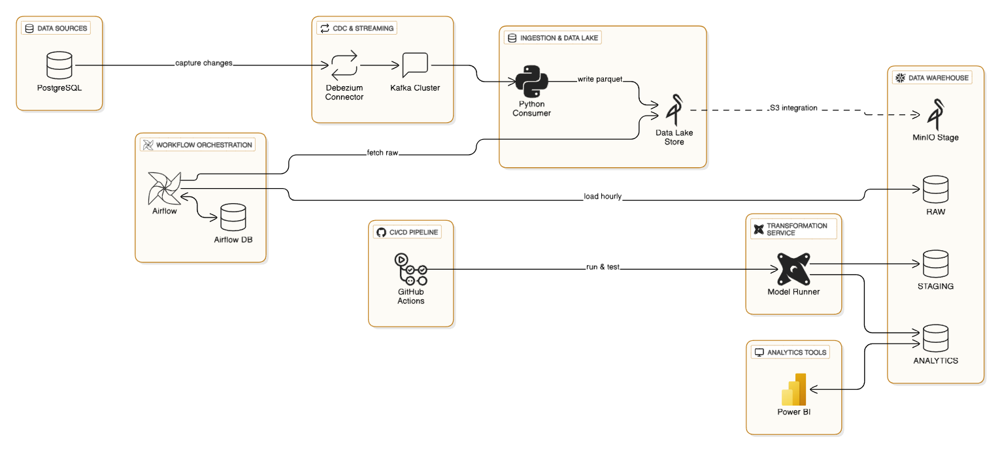

# Modern Data Stack Pipeline (Banking Domain)


**Technologies:** Kafka · Debezium · MinIO · Airflow · Snowflake · dbt · Docker · GitHub Actions · Python

---

## Overview

This project implements an **end-to-end Modern Data Stack (MDS)** pipeline for a **Banking domain**, enabling **near real-time data ingestion, transformation, and analytics-ready data warehousing**.

Data flows from a **PostgreSQL transactional system** → captured via **Debezium CDC into Kafka topics** → persisted in **MinIO** as Parquet → loaded into **Snowflake** via **Airflow DAGs** → transformed using **dbt (SCD Type-2 + incremental models)** → validated and deployed via **GitHub Actions CI/CD**.

> **Key highlight:** CDC-based pipeline with **micro-batching + idempotent ingestion + automated ELT orchestration**

---

## Architecture Overview

<p align="center">
  
</p>

```plaintext
PostgreSQL
   ↓ (CDC - Debezium)
Kafka Topics
   ↓
Kafka Consumer (Python - micro-batch)
   ↓
MinIO (Parquet - Bronze)
   ↓
Airflow DAG (5-minute schedule)
   ↓
Snowflake RAW
   ↓
dbt (staging → SCD2 → marts)
   ↓
Analytics / BI
````

---

## Architecture Layers

| Layer              | Tool / Service           | Description                                                |
| ------------------ | ------------------------ | ---------------------------------------------------------- |
| **Source**         | PostgreSQL               | Operational data (`customers`, `accounts`, `transactions`) |
| **CDC**            | Debezium + Kafka Connect | Captures INSERT/UPDATE/DELETE changes                      |
| **Streaming**      | Apache Kafka             | Message broker for CDC topics                              |
| **Ingestion**      | Python Consumer          | Micro-batch processing → Parquet                           |
| **Storage**        | MinIO                    | S3-compatible object store                                 |
| **Orchestration**  | Apache Airflow           | End-to-end ELT orchestration                               |
| **Warehouse**      | Snowflake                | RAW + ANALYTICS layers                                     |
| **Transformation** | dbt                      | Staging, marts, SCD Type-2                                 |
| **Automation**     | GitHub Actions           | CI/CD pipeline                                             |

---

## Key Design Decisions

### 1. CDC-based ingestion

* Uses Debezium to capture row-level changes
* Supports:

  * INSERT / UPDATE / DELETE
* Eliminates full refresh

---

### 2. Micro-batching (not true streaming)

* Kafka consumer buffers records (e.g. 50 records/batch)
* Writes Parquet files to MinIO

**Trade-off:**

* Efficient storage & compute
* Compatible with warehouse ingestion (Snowflake COPY)
* Not event-level real-time

Result: **Near real-time pipeline**

---

### 3. Idempotent ingestion

* Tracks processed files using:

  * Airflow Variables
* Ensures:

  * No duplicate loads
  * Safe retries

---

### 4. ELT orchestration (Airflow DAG)

Single DAG:

```
banking_cdc_elt_pipeline
```

Pipeline steps:

1. Detect new files in MinIO
2. Load into Snowflake RAW
3. Run dbt snapshot (SCD2)
4. Run dbt models (staging → marts)
5. Run dbt tests

---

### 5. Data modeling (dbt)

* **Staging layer** → clean CDC data
* **Snapshots** → SCD Type-2 history
* **Marts layer** → Star Schema

---

## Repository Structure

```bash
.
├── consumer/                 # Kafka → MinIO ingestion
├── data-generator/           # Fake data generator
├── docker/
│   ├── airflow/              # Airflow config
│   └── dags/
│       └── banking_cdc_elt_pipeline.py
├── banking_dbt/              # dbt project
├── kafka-debezium/           # CDC connector setup
├── tests/                    # unit tests
├── postgres/                 # schema
├── .github/workflows/        # CI/CD
```

---

## How to Run the Project

### 1. Start all services

```bash
docker-compose up -d
```

Includes:

* PostgreSQL
* Kafka + Zookeeper
* Debezium
* MinIO
* Airflow

---

### 2. Generate sample data

```bash
python data-generator/faker_generator.py
```

---

### 3. Run Kafka Consumer

```bash
python consumer/kafka_to_minio.py
```

Writes CDC events → MinIO (Parquet)

---

### 4. Run Airflow Pipeline

Access UI:

```
http://localhost:8080
```

Trigger DAG:

```
banking_cdc_elt_pipeline
```

---

### 5. Run dbt manually (optional)

```bash
cd banking_dbt
dbt deps
dbt run
dbt test
```

---

## Data Warehouse Design

### Medallion Architecture

| Layer  | Description                 | Example Tables                       |
| ------ | --------------------------- | ------------------------------------ |
| Bronze | Raw CDC data (Parquet)      | `raw.customers`                      |
| Silver | Cleaned staging             | `stg_customers`                      |
| Gold   | Analytics-ready Star Schema | `dim_customers`, `fact_transactions` |

---

### SCD Type-2 Example

```sql
SELECT *
FROM ANALYTICS.CUSTOMERS_SNAPSHOT
WHERE customer_id = 54;
```

Tracks full history:

| customer_id | name        | valid_from | valid_to | is_current |
| ----------- | ----------- | ---------- | -------- | ---------- |
| 54          | Realtime    | 01:56      | 05:21    | FALSE      |
| 54          | Realtime_V2 | 05:21      | NULL     | TRUE       |

---

## Testing & CI/CD

### Python Tests

```bash
pytest tests/
```

13 tests passed

---

### dbt Tests

* not_null
* unique
* relationships

28 tests passed in CI/CD

---

## CI/CD (GitHub Actions)

### CI

* Lint (ruff)
* Unit tests (pytest)
* dbt compile

### CD

* dbt run
* dbt test

---

## Example Queries

```sql
-- Customer history
SELECT *
FROM ANALYTICS.CUSTOMERS_SNAPSHOT;

-- Current customers
SELECT *
FROM ANALYTICS.DIM_CUSTOMERS_CURRENT;

-- Transaction aggregation
SELECT customer_id, SUM(amount)
FROM ANALYTICS.FACT_TRANSACTIONS
GROUP BY customer_id;
```

---

## Limitations

* Uses micro-batch → not true streaming
* No Spark/Flink streaming engine
* Dependent on Snowflake availability

---

## Future Enhancements

* Replace micro-batch with:

  * Spark Structured Streaming
* Add:

  * Great Expectations
* Deploy:

  * Airflow on Kubernetes
* Add:

  * BI dashboards (Power BI / Superset)

---

## Key Features

* CDC pipeline (Debezium + Kafka)
* Near real-time ingestion
* Data lake (MinIO)
* Automated Airflow DAG
* Snowflake warehouse
* dbt SCD Type-2 modeling
* CI/CD for data pipelines
